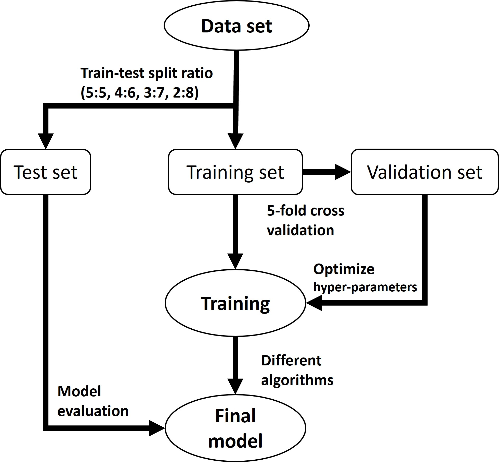

If you do not have any data, you can download my data from [Zenodo](https://doi.org/10.5281/zenodo.8312801)                   

***a.Isotherms obatined by GCMC simulations (RASPA2.0)***                   
***b.Saturation loading predicted by Machine learning (xgboost, et al)***                                                
***c.Vacuum swing adsorption simulated by python and matlab (ideal & high-fidelity)***                                                               

### Part 1. RASPA          
* Xe/Kr isotherms (T=298 K, P=0-30 bar)                   
* Xe/Kr themodynamic(T=298 K)                     
* Force field can be found from SI of Xe/Kr paper
* Check PLD:
  
* Example:
  ```SimulationType                        MonteCarlo       # calc method
      NumberOfCycles                        20000           # calc cycles 
      NumberOfInitializationCycles          10000           # equilibration cycles
      
      Forcefield                            XeKrFF          # force field folder of framework and adsorbate (in the share/force field/)
      CutOff                                12              # cutoff
      
      Framework                             0               #  component of framework
      FrameworkName                         # Frame         # framework name (cif file)
      UnitCells                             # Unit          # unit cell (a/b/c must > 2*cutoff)
      ExternalTemperature                   298             # simu at T                       
                                                    
      ExternalPressure                      # pressure      # simu at P                 
      
      ChargeMethod                          None            # coulomb                 
      EwaldPrecision                        1e-5            # charge precision           
      UseChargesFromCIFFile                 no              # atomic charge in cif file?          
                       
      RemoveAtomNumberCodeFromLabel yes                     # remove number of element label from cif file        
      Movies                        yes                     # save movie files?                              
      
      Component 0 MoleculeName xenon                        # adsorbate name        
                  MoleculeDefinition XeKr                   # adsorbate define file (in the share/molecules/)
                  TranslationProbability 1.0                # probability of *
                  ReinsertionProbability 1.0                # ~ 
                  SwapProbability        1.0                # ~ 
                  RotationProbability    1.0                # ~ 
                  CreateNumberOfMolecules 0                 # define number of adsorbate?

### Part 2. Machine learning            
* Features calculation by Zeo++ and RASPA2.0             

* ML workflow:
  
### Part 3. VSA simulations
* Ideal VSA workflow:
  
